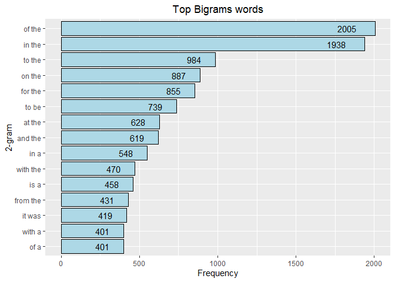

Task 1: Getting and Cleaning the Data
-------------------------------------

### Introduction

Large databases comprising of text in a target language are commonly used when generating language models for various purposes. In this exercise, you will use the **English database** but may consider three other databases in German, Russian and Finnish.

The goal of this task is to get familiar with the databases and do the necessary cleaning. After this exercise, you should understand what real data looks like and how much effort you need to put into cleaning the data. When you commence on developing a new language, the first thing is to understand the language and its peculiarities with respect to your target. You can learn to read, speak and write the language. Alternatively, you can study data and learn from existing information about the language through literature and the internet. At the very least, you need to understand how the language is written: writing script, existing input methods, some phonetic knowledge, etc.

Note that the data contain words of offensive and profane meaning. They are left there intentionally to highlight the fact that the developer has to work on them.

*Tasks to accomplish*

1.  Tokenization - identifying appropriate tokens such as words, punctuation, and numbers. Writing a function that takes a file as input and returns a tokenized version of it.

2.  Profanity filtering - removing profanity and other words you do not want to predict.

*Tips, tricks, and hints*

1.  **Loading the data in.** This dataset is fairly large. We emphasize that you don't necessarily need to load the entire dataset in to build your algorithms (see point 2 below). At least initially, you might want to use a smaller subset of the data. Reading in chunks or lines using R's readLines or scan functions can be useful. You can also loop over each line of text by embedding readLines within a for/while loop, but this may be slower than reading in large chunks at a time. Reading pieces of the file at a time will require the use of a file connection in R. For example, the following code could be used to read the first few lines of the English Twitter dataset:

### Load libraries neccesssary for the project

```r
library(tm)
```

```
## Loading required package: NLP
```

```r
library(RWeka) 
library(dplyr)
```

```
## 
## Attaching package: 'dplyr'
```

```
## The following objects are masked from 'package:stats':
## 
##     filter, lag
```

```
## The following objects are masked from 'package:base':
## 
##     intersect, setdiff, setequal, union
```

```r
library(ggplot2)
```

```
## 
## Attaching package: 'ggplot2'
```

```
## The following object is masked from 'package:NLP':
## 
##     annotate
```

### Download and load file from the web **(Date: March 1st, 2022)**

```r
url <- "https://d396qusza40orc.cloudfront.net/dsscapstone/dataset/Coursera-SwiftKey.zip"
download.file(url, dest = "capstone_dataset.zip")
unzip ("capstone_dataset.zip")
```

### Read the files

```r
url_directory <- "C:/Users/maigu/OneDrive/Documentos/Eli/datasciencecoursera/Data-Science-Capstone/final/en_US/"
url_twitter <- paste(url_directory, "en_US.twitter.txt", sep = "")
url_blogs <- paste(url_directory, "en_US.blogs.txt", sep = "")
url_news <- paste(url_directory, "en_US.news.txt", sep = "")


twitter_file <- readLines(url_twitter, encoding="UTF-8")
```

```
## Warning in readLines(url_twitter, encoding = "UTF-8"): line 167155 appears to
## contain an embedded nul
```

```
## Warning in readLines(url_twitter, encoding = "UTF-8"): line 268547 appears to
## contain an embedded nul
```

```
## Warning in readLines(url_twitter, encoding = "UTF-8"): line 1274086 appears to
## contain an embedded nul
```

```
## Warning in readLines(url_twitter, encoding = "UTF-8"): line 1759032 appears to
## contain an embedded nul
```

```r
blogs_file <- readLines(url_blogs, encoding="UTF-8")
news_file <- readLines(url_news, encoding="UTF-8")
```

```
## Warning in readLines(url_news, encoding = "UTF-8"): incomplete final line found
## on 'C:/Users/maigu/OneDrive/Documentos/Eli/datasciencecoursera/Data-Science-
## Capstone/final/en_US/en_US.news.txt'
```

### Getting badwords file from web

```r
badwords_url <-"http://www.cs.cmu.edu/~biglou/resources/bad-words.txt"
download.file(badwords_url, destfile = "bad-words.txt")
badwords <- readLines("bad-words.txt", encoding="UTF-8")
```

### Setting a subset of the data to work with

```r
set.seed(19800916)

#Get all the subset samples files together
subset_all_data <- c(sample(twitter_file, 5000), sample(blogs_file, 5000), sample(news_file, 5000))
```

### Clean and organize the data


```r
# Get subset into clean data to work
clean_data <- subset_all_data

# Remove special characters from dataset
clean_data <- iconv(clean_data, "UTF-8", "ASCII", sub = "")

# Remove numbers from dataset
clean_data <- removeNumbers(clean_data)

# Remove white spaces from dataset
clean_data <- stripWhitespace(clean_data) 

# Set the entire dataset to lower case
clean_data <- tolower(clean_data) 

# Remove punctuation
clean_data <- removePunctuation(clean_data)

# Remove bad words from dataset
clean_data <- removeWords(clean_data, c(badwords))
```

### Getting information about the files

```r
data.frame(file = c("Twitter", "Blogs", "News"),
           size_MB = c(format(object.size(twitter_file), "MB"),
                       format(object.size(blogs_file), "MB"),
                       format(object.size(news_file), "MB")),
           lines = c(length(readLines(url_twitter)),
                     length(readLines(url_blogs)),
                     length(readLines(url_news))),
           longest_line = c(summary(nchar(twitter_file))[6],
                            summary(nchar(blogs_file))[6],
                            summary(nchar(news_file))[6])
)
```

```
## Warning in readLines(url_twitter): line 167155 appears to contain an embedded
## nul
```

```
## Warning in readLines(url_twitter): line 268547 appears to contain an embedded
## nul
```

```
## Warning in readLines(url_twitter): line 1274086 appears to contain an embedded
## nul
```

```
## Warning in readLines(url_twitter): line 1759032 appears to contain an embedded
## nul
```

```
## Warning in readLines(url_news): incomplete final line found on 'C:/Users/maigu/
## OneDrive/Documentos/Eli/datasciencecoursera/Data-Science-Capstone/final/en_US/
## en_US.news.txt'
```

<div data-pagedtable="false">
  <script data-pagedtable-source type="application/json">
{"columns":[{"label":["file"],"name":[1],"type":["chr"],"align":["left"]},{"label":["size_MB"],"name":[2],"type":["chr"],"align":["left"]},{"label":["lines"],"name":[3],"type":["int"],"align":["right"]},{"label":["longest_line"],"name":[4],"type":["dbl"],"align":["right"]}],"data":[{"1":"Twitter","2":"319 Mb","3":"2360148","4":"140"},{"1":"Blogs","2":"255.4 Mb","3":"899288","4":"40833"},{"1":"News","2":"19.8 Mb","3":"77259","4":"5760"}],"options":{"columns":{"min":{},"max":[10]},"rows":{"min":[10],"max":[10]},"pages":{}}}
  </script>
</div>

### Quiz 1: Getting Started  
#### Question 1  
The en_US.blogs.txt file is how many megabytes?    

*Answer:* According to the above table the Blogs files is 255.4 Mb large.  

#### Question 2  
The en_US.twitter.txt has how many lines of text?    

*Answer:* According to the above table the Twitter file has 2360148 lines.  

#### Question 3  
What is the length of the longest line seen in any of the three en_US data sets?   

*Answer:* According to the above table the Blogs file has the longest line with 40835 characters.

#### Question 4  
In the en_US twitter data set, if you divide the number of lines where the word "love" (all lowercase) occurs by the number of lines the word "hate" (all lowercase) occurs, about what do you get?   


```r
sum(grepl("love", twitter_file)) / sum(grepl("hate", twitter_file))
```

```
## [1] 4.108592
```
#### Question 5  
The one tweet in the en_US twitter data set that matches the word "biostats" says what?  


```r
twitter_file[grepl("biostats", twitter_file)]
```

```
## [1] "i know how you feel.. i have biostats on tuesday and i have yet to study =/"
```

#### Question 6
How many tweets have the exact characters "A computer once beat me at chess, but it was no match for me at kickboxing". (I.e. the line matches those characters exactly.)


```r
grep("A computer once beat me at chess, but it was no match for me at kickboxing", twitter_file)
```

```
## [1]  519059  835824 2283423
```


Task 2 - Exploratory Data Analysis
----------------------------------

### Introduction

The first step in building a predictive model for text is understanding the distribution and relationship between the words, tokens, and phrases in the text. The goal of this task is to understand the basic relationships you observe in the data and prepare to build your first linguistic models.

Tasks to accomplish

1.  **Exploratory analysis** - perform a thorough exploratory analysis of the data, understanding the distribution of words and relationship between the words in the corpora.

2.  **Understand frequencies of words and word pairs** - build figures and tables to understand variation in the frequencies of words and word pairs in the data.

Questions to consider

1.  Some words are more frequent than others - what are the distributions of word frequencies?
2.  What are the frequencies of 2-grams and 3-grams in the dataset?
3.  How many unique words do you need in a frequency sorted dictionary to cover 50% of all word instances in the language? 90%?
4.  How do you evaluate how many of the words come from foreign languages?
5.  Can you think of a way to increase the coverage -- identifying words that may not be in the corpora or using a smaller number of words in the dictionary to cover the same number of phrases?


### Tokenizing clean sample


```r
tokens <- function(x, y){
        x <- NGramTokenizer(clean_data, Weka_control(min = y, max = y))
        x <- data.frame(table(x))
        x <- x[order(x$Freq, decreasing = TRUE), ]
}

unigrams_token <- tokens(clean_data, 1)
bigrams_token <- tokens(clean_data, 2)
trigrams_token <- tokens(clean_data, 3)

all_data_unigrams <- c(twitter_file, news_file, blogs_file) %>% tokens(1)
```

### Plot the frequency of unigrams


```r
unigrams_token[1:15,] %>%
        ggplot(aes(x = reorder(x, Freq), y = Freq)) +
        geom_bar(stat ='identity', 
                 colour = "black", 
                 fill = "lightcoral") +
        geom_text(label = unigrams_token$Freq[1:15], 
                  size = 4, 
                  hjust = 2) +
        xlab("1-gram") + 
        ylab("Frequency") + 
        ggtitle("Top Unigrams words") +
        theme(plot.title = element_text(hjust = 0.5))+
        coord_flip()
```

<!-- -->

### Plot the frequency of bigrams   


```r
bigrams_token[1:15,] %>%
        ggplot(aes(x = reorder(x, Freq), y = Freq)) +
        geom_bar(stat ='identity', 
                 colour = "black", 
                 fill = "lightblue") +
        geom_text(label = bigrams_token$Freq[1:15], 
                  size = 4, 
                  hjust = 2) +
        xlab("2-gram") + 
        ylab("Frequency") + 
        ggtitle("Top Bigrams words") +
        theme(plot.title = element_text(hjust = 0.5))+
        coord_flip()
```

<!-- -->

### Plot the frequency of trigrams   


```r
trigrams_token[1:15,] %>%
        ggplot(aes(x = reorder(x, Freq), y = Freq)) +
        geom_bar(stat ='identity', 
                 colour = "black", 
                 fill = "springgreen4") +
        geom_text(label = trigrams_token$Freq[1:15], 
                  size = 4, 
                  hjust = 2) +
        xlab("3-gram") + 
        ylab("Frequency") + 
        ggtitle("Top Trigrams words") +
        theme(plot.title = element_text(hjust = 0.5))+
        coord_flip()
```

<!-- -->


#### How many unique words do you need in a frequency sorted dictionary to cover 50% of all word instances in the language? 90%?


```r
# Total of unique words in the three files
total <- sum(all_data_unigrams$Freq)

p <- cumsum(unigrams_token$Freq)/sum(unigrams_token$Freq)

# 50% covered
which(p>=0.5)[1]
```

```
## [1] 132
```

```r
# Percentage of total
which(p>=0.5)[1]/total*100
```

```
## [1] 0.03071846
```

```r
# 90% covered
which(p>=0.9)[1]
```

```
## [1] 7087
```

```r
# Percentage of total
which(p>=0.9)[1]/total*100
```

```
## [1] 1.649256
```
With these calculations we can infer:

- 50% of the words instances in the Corpus are covered by only 132 most popular words out of 429709 unique words available in the corpora (0.03%).
- 90% of the words instances in the Corpus are covered by only 7087 most popular words out of 429709 unique words available in the corpora (1.65%).


#### How do you evaluate how many of the words come from foreign languages?

We could create a dataset with all the words from the dictionary and use them to compare to the sample.


Task 3: Modeling
----------------
### Introduction

The goal here is to build your first simple model for the relationship between words. This is the first step in building a predictive text mining application. You will explore simple models and discover more complicated modeling techniques.

_Tasks to accomplish_

1.  Build basic n-gram model - using the exploratory analysis you performed, build a basic [n-gram model](http://en.wikipedia.org/wiki/N-gram "Link: http://en.wikipedia.org/wiki/N-gram") for predicting the next word based on the previous 1, 2, or 3 words.

2.  Build a model to handle unseen n-grams - in some cases people will want to type a combination of words that does not appear in the corpora. Build a model to handle cases where a particular n-gram isn't observed.


_Questions to consider_

1.  How can you efficiently store an n-gram model (think Markov Chains)?

2.  How can you use the knowledge about word frequencies to make your model smaller and more efficient?

3.  How many parameters do you need (i.e. how big is n in your n-gram model)?

4.  Can you think of simple ways to "smooth" the probabilities (think about giving all n-grams a non-zero probability even if they aren't observed in the data) ?

5.  How do you evaluate whether your model is any good?

6.  How can you use [backoff models](http://en.wikipedia.org/wiki/Katz%27s_back-off_model) to estimate the probability of unobserved n-grams?


_Hints, tips, and tricks_

As you develop your prediction model, two key aspects that you will have to keep in mind are the size and runtime of the algorithm. These are defined as:

1.  **Size**: the amount of memory (physical RAM) required to run the model in R

2.  **Runtime**: The amount of time the algorithm takes to make a prediction given the acceptable input


Your goal for this prediction model is to minimize both the size and runtime of the model in order to provide a reasonable experience to the user.

Keep in mind that currently available predictive text models can run on mobile phones, which typically have limited memory and processing power compared to desktop computers. Therefore, you should consider very carefully (1) how much memory is being used by the objects in your workspace; and (2) how much time it is taking to run your model. Ultimately, your model will need to run in a Shiny app that runs on the [shinyapps.io](https://www.shinyapps.io/) server.

_Tips, tricks, and hints_

Here are a few tools that may be of use to you as you work on their algorithm:

-   object.size(): this function reports the number of bytes that an R object occupies in memory

-   Rprof(): this function runs the profiler in R that can be used to determine where bottlenecks in your function may exist. The profr package (available on CRAN) provides some additional tools for visualizing and summarizing profiling data.

-   gc(): this function runs the garbage collector to retrieve unused RAM for R. In the process it tells you how much memory is currently being used by R.


There will likely be a tradeoff that you have to make in between size and runtime. For example, an algorithm that requires a lot of memory, may run faster, while a slower algorithm may require less memory. You will have to find the right balance between the two in order to provide a good experience to the user.

### Model

The goal for this project is to deployed a Shiny app for a user to type a phrase or multiple words and that the app to predict what would be the next word.

This predictive algorithm would use an n-gram model to lookup in a word frequency like the one created for the [task 2: Exploratory Analysis](#task-2---exploratory-data-analysis). 

A possible strategy would be to predict the next word using the trigrams dataset. In the case that that would be unsuccessful to check on the bigrams dataset and if this would still not possible to check in the unigrams.


## Github repository
[Link to Github](https://github.com/elisavillar/Data-Science-Capstone-Johns-Hopkins-University)

## Session Information

```r
sessionInfo()
```

```
## R version 4.1.2 (2021-11-01)
## Platform: x86_64-w64-mingw32/x64 (64-bit)
## Running under: Windows 10 x64 (build 19043)
## 
## Matrix products: default
## 
## locale:
## [1] LC_COLLATE=English_Canada.1252  LC_CTYPE=English_Canada.1252   
## [3] LC_MONETARY=English_Canada.1252 LC_NUMERIC=C                   
## [5] LC_TIME=English_Canada.1252    
## 
## attached base packages:
## [1] stats     graphics  grDevices utils     datasets  methods   base     
## 
## other attached packages:
## [1] ggplot2_3.3.5 dplyr_1.0.8   RWeka_0.4-44  tm_0.7-8      NLP_0.2-1    
## 
## loaded via a namespace (and not attached):
##  [1] Rcpp_1.0.8        highr_0.9         bslib_0.3.1       compiler_4.1.2   
##  [5] pillar_1.7.0      jquerylib_0.1.4   tools_4.1.2       RWekajars_3.9.3-2
##  [9] digest_0.6.29     gtable_0.3.0      tibble_3.1.6      jsonlite_1.7.3   
## [13] evaluate_0.15     lifecycle_1.0.1   pkgconfig_2.0.3   rlang_1.0.1      
## [17] cli_3.2.0         rstudioapi_0.13   yaml_2.3.5        parallel_4.1.2   
## [21] xfun_0.29         fastmap_1.1.0     rJava_1.0-6       withr_2.4.3      
## [25] stringr_1.4.0     xml2_1.3.3        knitr_1.37        generics_0.1.2   
## [29] sass_0.4.0        vctrs_0.3.8       tidyselect_1.1.2  grid_4.1.2       
## [33] glue_1.6.1        R6_2.5.1          fansi_1.0.2       rmarkdown_2.11   
## [37] farver_2.1.0      purrr_0.3.4       magrittr_2.0.2    codetools_0.2-18 
## [41] scales_1.1.1      htmltools_0.5.2   ellipsis_0.3.2    colorspace_2.0-3 
## [45] labeling_0.4.2    utf8_1.2.2        stringi_1.7.6     munsell_0.5.0    
## [49] slam_0.1-50       crayon_1.5.0
```

---


